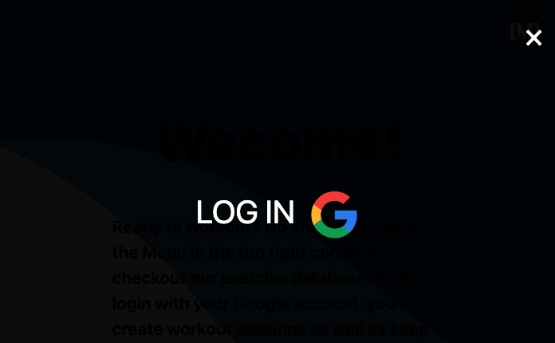

# SEIFitnessApp

Stargate - 04192341412

--------------------------------------

SEIFitness App

Stargate - 04192341412

--------------------------------------

SEIFitness App

Our app is mobile friendly first. The welcome page displays an introduction to the app before a user logs in to view the library of workouts. 

Next, a user can choose from the available workouts or open the menu and create their own. 

When a user chooses an existing workout they are directed to a page which displays directions for the workout including sets, reps, weights and equipment.

If a user chooses to create their own workout, they can determine directions for the workout including sets, reps, weights and equipment.

A user has the ability to change or remove their own workouts.

----------------------------------------

Screenshots

----------------------------------------

Technologies Used

- JavaScript
- HTML
- CSS
- Bootstrap
- Express
- Node.js
- Mongoose
- MongoDB
- Fly.io

----------------------------------------
Getting Started

App:
https://seifitnessapp.fly.dev/

Trello:
https://trello.com/b/lYlrjgcm/sei-fitness-app-tasks

----------------------------------------
Next Steps

Future Enhancements

-A user would be able to select specific exercises from a drop down menu when creating their workout.

-A user would be able to select equipment from a drop down menu when creating their workout.

-A user would be able to record the intensity, reps, sets, etc and other details of their workout, similar to a review.

-A user would be able to select a workout and place it in a calendar in order to plan a series of workouts.

